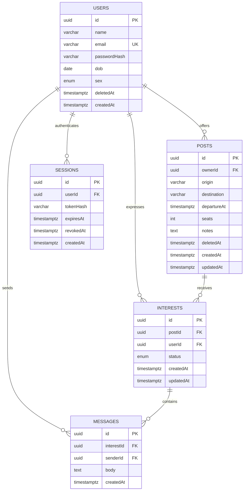

# PostgreSQL schema

All application tables live in `commuteconnect`. The migration is `CommuteConnect-backend/src/database/migrations/1789100000000-InitialSchema.ts`.

- Unique normalized emails and unique `(postId, userId)` interests.
- Account deletion keeps the identity row as a disabled legal record, erases DOB/sex, explicitly deletes the user's interests and posts, and relies on foreign-key cascades to remove dependent messages. Ordinary post deletion remains a soft cancellation for participant history.
- Database checks enforce seat bounds, notes length, normalized emails and distinct origin/destination. DTOs enforce string lengths and types. Cross-row authorization and seat capacity are enforced transactionally by services.
- Post-row locks serialize interest acceptance/withdrawal/creation and post mutation. Availability is derived from accepted rows; there is no counter that can drift. Requests acquire the post lock before changing interest rows.
- Partial upcoming-post and trigram route indexes for discovery, owner index for dashboards, `(userId,status)` and `(postId,status)` indexes for interests, message conversation/sender indexes, and session user/expiry indexes.
- Queries use a stable secondary UUID order for deterministic pagination. Offset pagination is intentionally used for this small app; cursor pagination would be the next step for a much larger feed.
- Personal profile fields are excluded by response selection from all shared views.
- Migrations run explicitly before application startup; `synchronize: false` prevents automatic production schema changes.